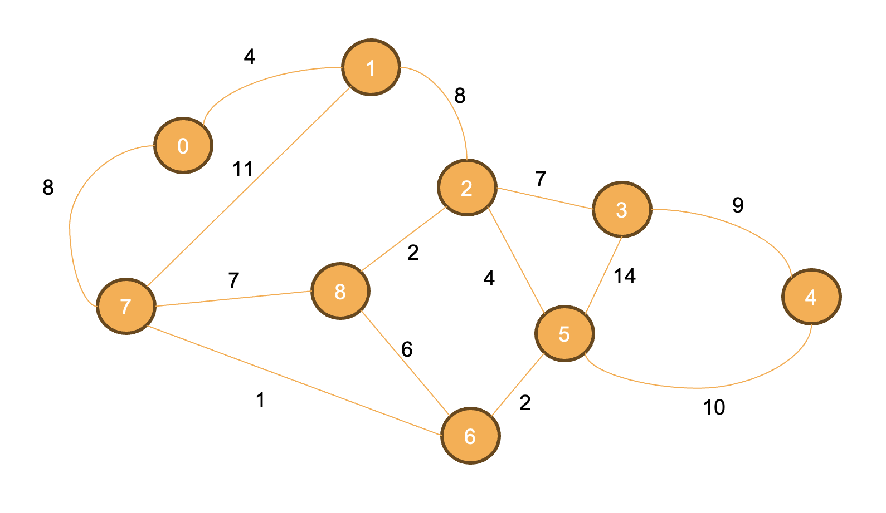
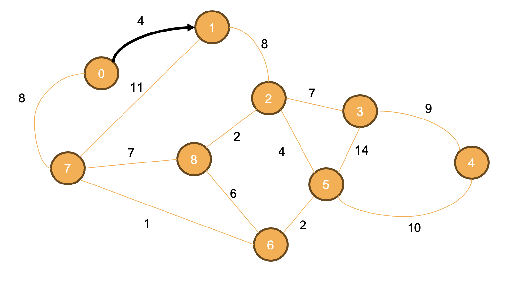
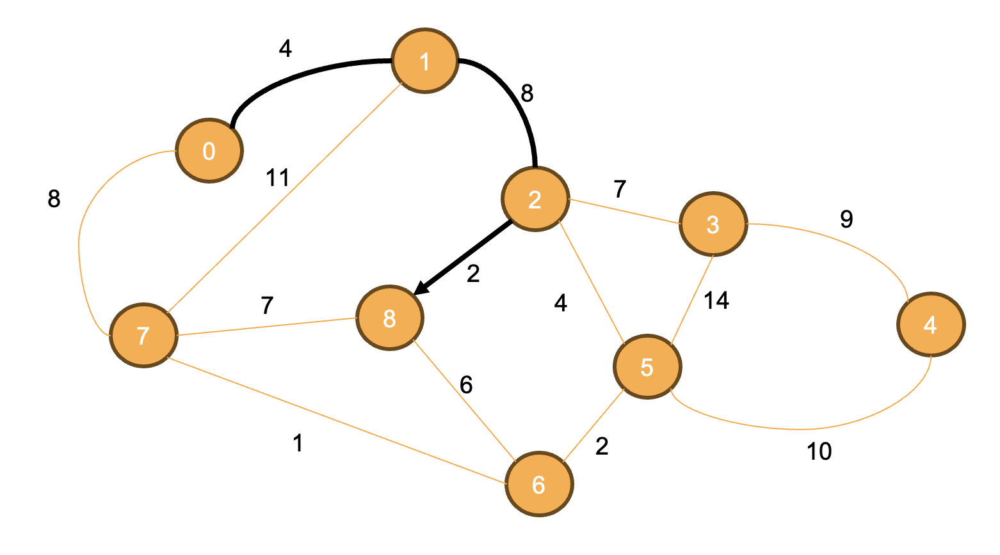

# graphs_rnh

A small Python library of graph algorithms, built around Dijkstra's
shortest path algorithm. Given a weighted directed graph and a source
vertex, it returns the lowest cost to reach every other vertex, along
with the actual path taken.

GitHub URL: https://github.com/Riconashty/graphs_rnh

## Installation

Install directly from GitHub:

```bash
pip install git+https://github.com/Riconashty/graphs_rnh.git
```

Or clone and install locally:

```bash
git clone https://github.com/Riconashty/graphs_rnh.git
cd graphs_rnh
pip install .
```

Requires Python 3.9 or later. No third-party dependencies.

## Usage

A graph is a dictionary of dictionaries: `graph[u][v]` is the weight of
the edge from `u` to `v`.

```python
from graphs_rnh import sp

graph = {
    0: {1: 4, 2: 1},
    1: {3: 1},
    2: {1: 2, 3: 5},
    3: {},
}

dist, path = sp.dijkstra(graph, 0)

print(dist)   # {0: 0, 1: 3, 2: 1, 3: 4}
print(path)   # {0: [], 1: [0, 2], 2: [0], 3: [0, 2, 1]}
```

`dijkstra(graph, source)` returns two dictionaries:

- `dist` — the total cost to reach each vertex from `source`
- `path` — the vertices visited on the way to each one, not including
  the destination itself

So reaching vertex 3 costs 4, travelling `0 → 2 → 1 → 3`, which beats
the direct `0 → 2 → 3` edge of weight 5.

## Running the example graphs

The `data/` folder holds sample graphs, one edge per line as
`source destination weight`:

```bash
python test.py data/example1.txt
```

## What's included

- `sp.dijkstra(graph, source)` — shortest paths from a source vertex
- `sp.total_nodes(graph)` - returns the total number of nodes in a given graph
- `heapq` — a bundled min-heap implementation used by `dijkstra`


# The Shortest Path Problem

A graph is a data structure that connects nodes identified by labels. In a graph, a node is normally called **vertex** and the connections between two vertices is called **edge**. The cost to travel through an edge is its **weight**. Below is an example of a weighted graph with 9 vertices. 



The **shortest path problem** is about finding the shortest paths from a given source vertex to all vertices. For example, the shortest path to reach vertex "1" from source vertex "0" is shown below, and it has a cost of 4. 



The shortest path to reach vertex "8" from source vertex "0" is shown below, and it has a cost of 14. 



# Dijkstra's Shortest Path Algorithm

Edsger W. Dijkstra was a Dutch computer scientist that made many contributions to the field, including a solution to the shortest path problem in a graph. The solution discussed here uses a min-heap to store the shortest known distances from the source. Let's look at a step-by-step execution of the algorithm for the example above. 

The algorithm begins by adding the cost to reach the source vertex, which is (of course) 0. We will use the notation (source, weight) to represent that. In the solution for the shortest path problem, the heap uses the weight of an edge to sort the values. A distance list is created to record the cost to reach each of the destinations from source. The distance list is initialized with the maximum possible value for the weight, represented as ∞, except to reach the source, which should be set to zero. 

The distances are initialized as: [0, ∞, ∞, ∞, ∞, ∞, ∞, ∞, ∞]

Hint: to represent ∞ in your code use **sys.maxsize**. 

Next, the algorithm will run a loop until the heap becomes empty. At each iteration of that loop, the following steps are taken: 

* the top of the heap (i.e., its smaller element) is removed; 
* refer to that edge as (u, w), where w represents the best (known) cost to reach node u from source; 
* next, the algorithm evaluates if the cost to reach each of u's neighbors is better than what is known so far; 
* for example, if v is one of u's neighbor, then the algorithm checks if the cost to reach node u plus the weight from u to v is smaller than what is recorded in the distance array; 
* if that is the case, the distance array is updated; 
* also, if the cost is updated, the algorithm needs to update that cost if edge v is found in the heap. 

For the example, (u, w) = (0, 0) in the first iteration. Nodes 1 and 7 can be reached from u=0 with costs 4 and 8, respectively. Therefore, the distances are updated to [0, 4, ∞, ∞, ∞, ∞, ∞, 8, ∞]. Also, (1, 4) and (7, 8) are added to the heap, which should now look like: 

```
    (1, 4)
(7, 8)
```

On the second iteration, (u, w) = (1, 4).  Nodes 0, 2 and 7 can be reached from u=1 with costs 4, 8 and 11, respectively. The distance to node 2 is updated (with a cost of 4+8=12) and the pair (2, 12) is added to the heap. The distance to node 0 does not get updated because travelling to node 0 through node 1 didn't improve the cost: 4 vs. 0. Also, the distance to node 7 does not get updated because travelling to node 7 through node 1 didn't improve the cost: 15 vs. 8. The heap should now look like: 

```
    (7, 8)
(2, 12)    
```

The distances are now: [0, 4, 12, ∞, ∞, ∞, ∞, 8, -]

On the third iteration, (u, w) = (7, 8).  Nodes 0, 1, 6, and 8 can be reached from u=7 with costs 8, 11, 1 and 7, respectively. The distance to node 6 is updated (with a cost of 8+1=9) and the pair (6, 9) is added to the heap. The distance to node 8 is also updated (with a cost of 8+7=15) and the pair (8, 15) is added to the heap. The heap should now look like: 

```
    (6, 9)
(2, 12) (8, 15)  
```

The distances are now: [0, 4, 12, ∞, ∞, ∞, 9, 8, 15]

The algorithm repeats until the heap becomes empty. At the end of the loop the array of distances should have the lowest costs to reach each of the destinations from the source. 
